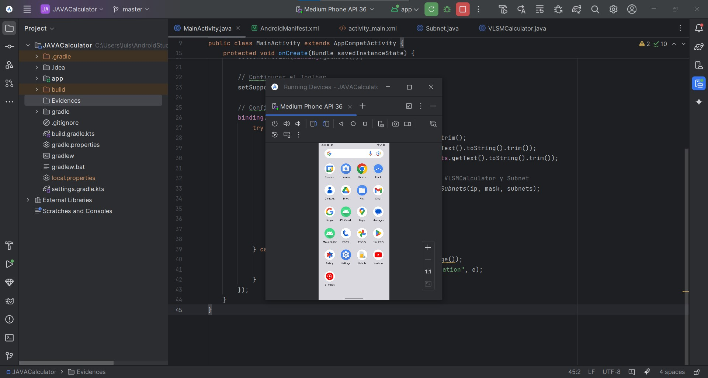
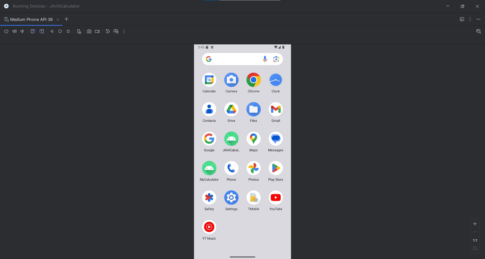
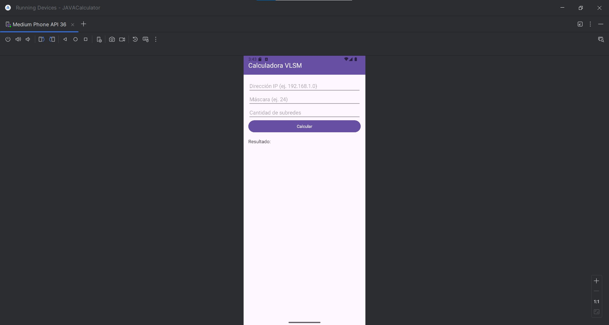
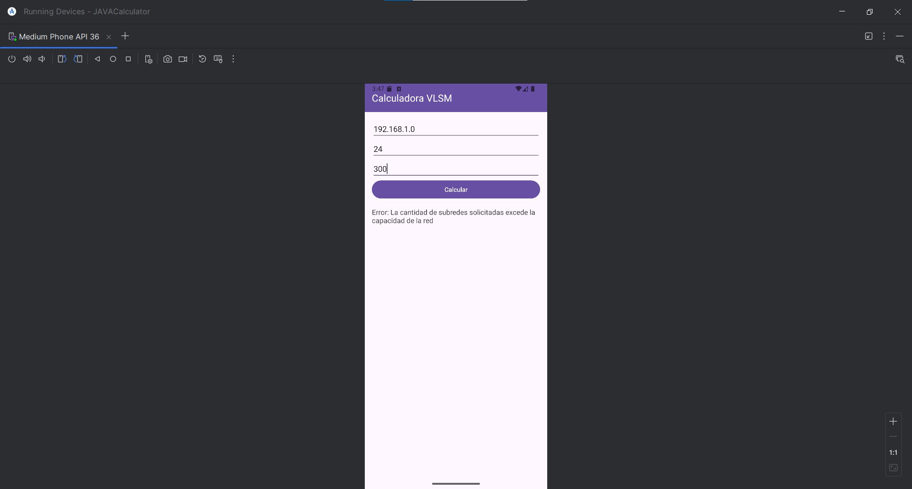
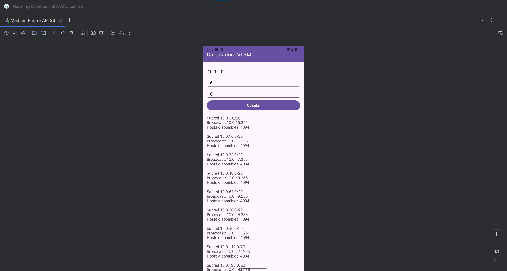
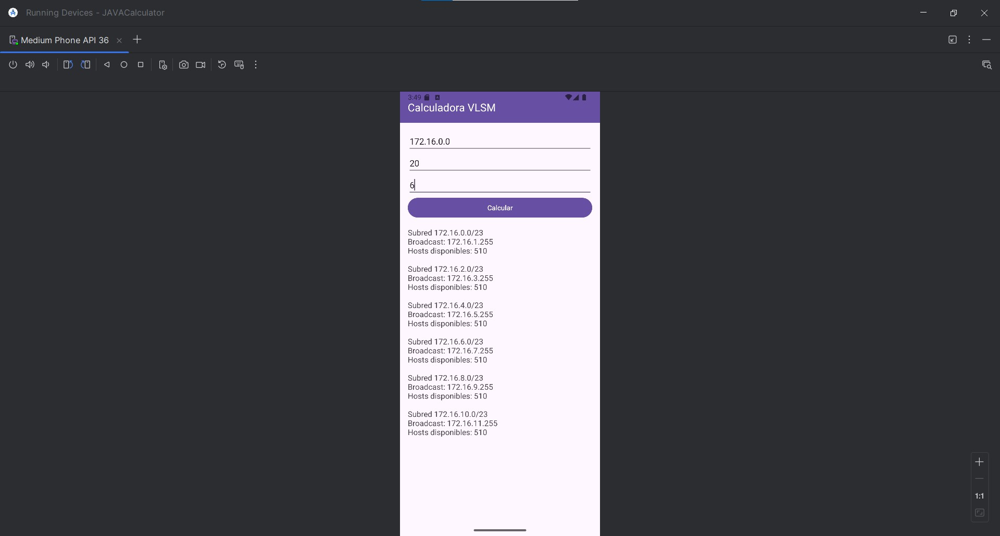
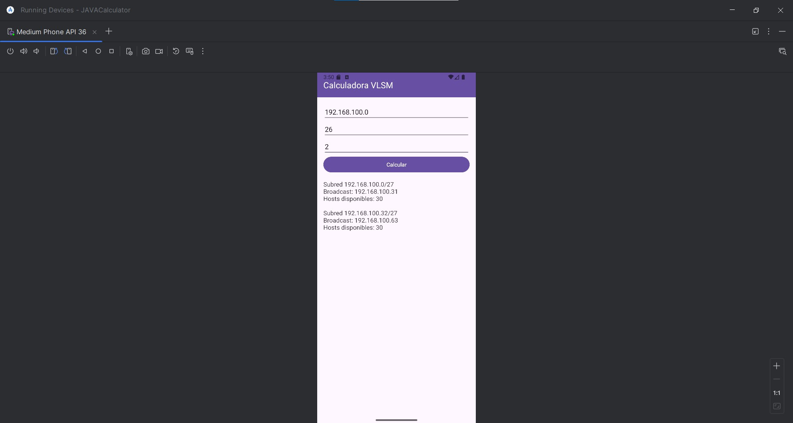
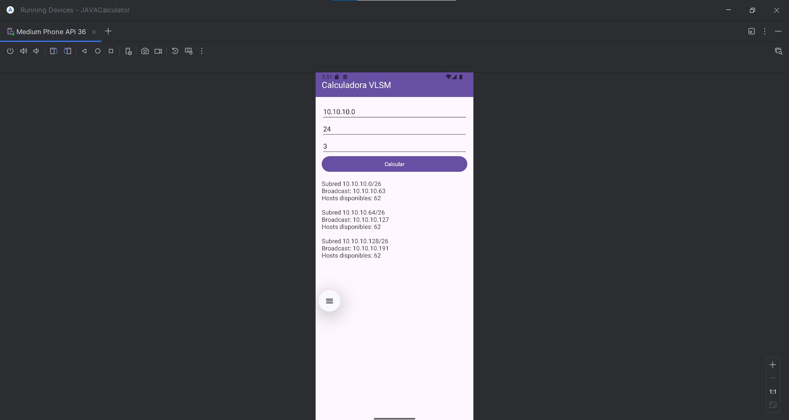

# Evidencia de funcionamiento de la "VLSM Calculator with Java"
Capturas de pantalla de la aplicación en funcionamiento

Ejecución de Emulador:

Ejecución de Aplicación:

Ejemplo 1 con: 

IP: 192.168.10.0

Mascara: 24

Subredes requeridas: 4

Ejemplo 2 (Se solicitan mas subredes de las posibles para comprobar funcionamiento): 

IP: 192.168.1.0

Mascara: 24

Subredes requeridas: 300

Ejemplo 3 con: 

IP: 10.0.0.0

Mascara: 16

Subredes requeridas: 10

Ejemplo 4 con: 

IP: 172.16.0.0

Mascara: 20

Subredes requeridas: 6

Ejemplo 5 con: 

IP: 192.168.100.0

Mascara: 26

Subredes requeridas: 2

Ejemplo 6 con: 

IP: 10.10.10.0

Mascara: 24

Subredes requeridas: 3

